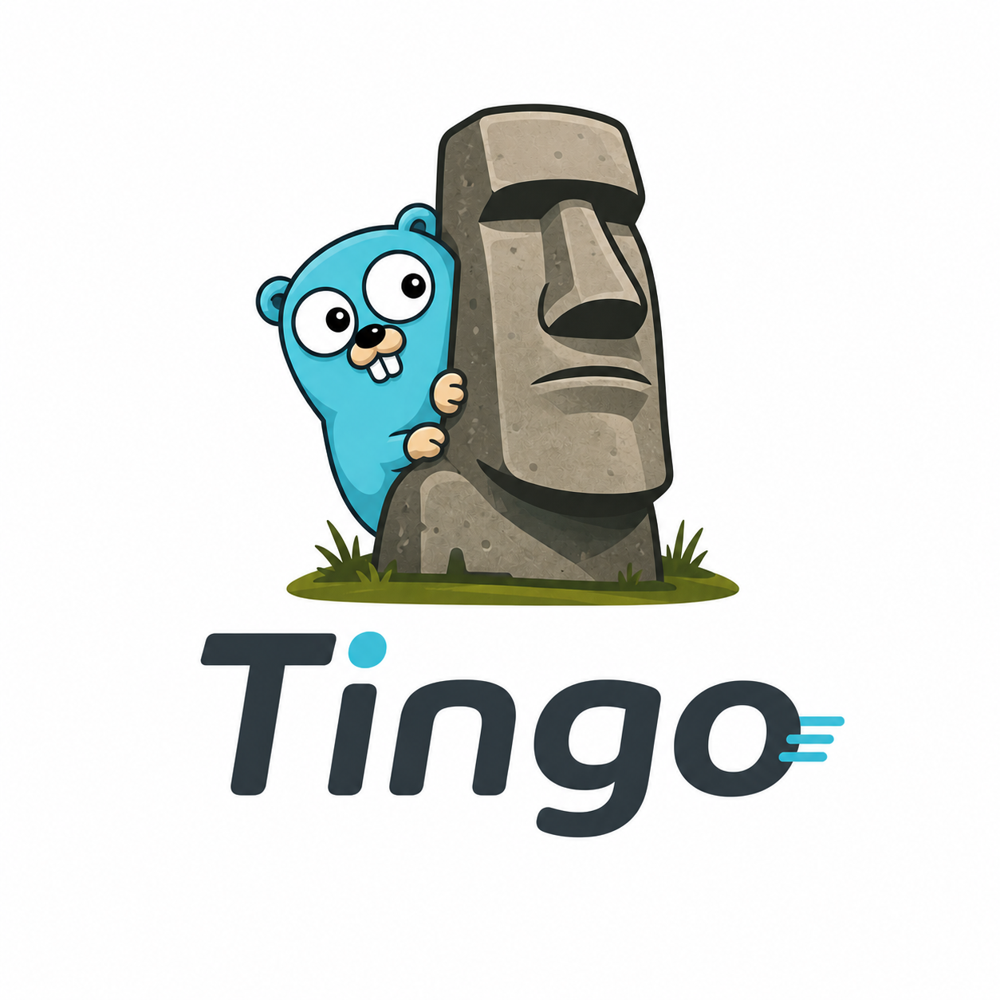
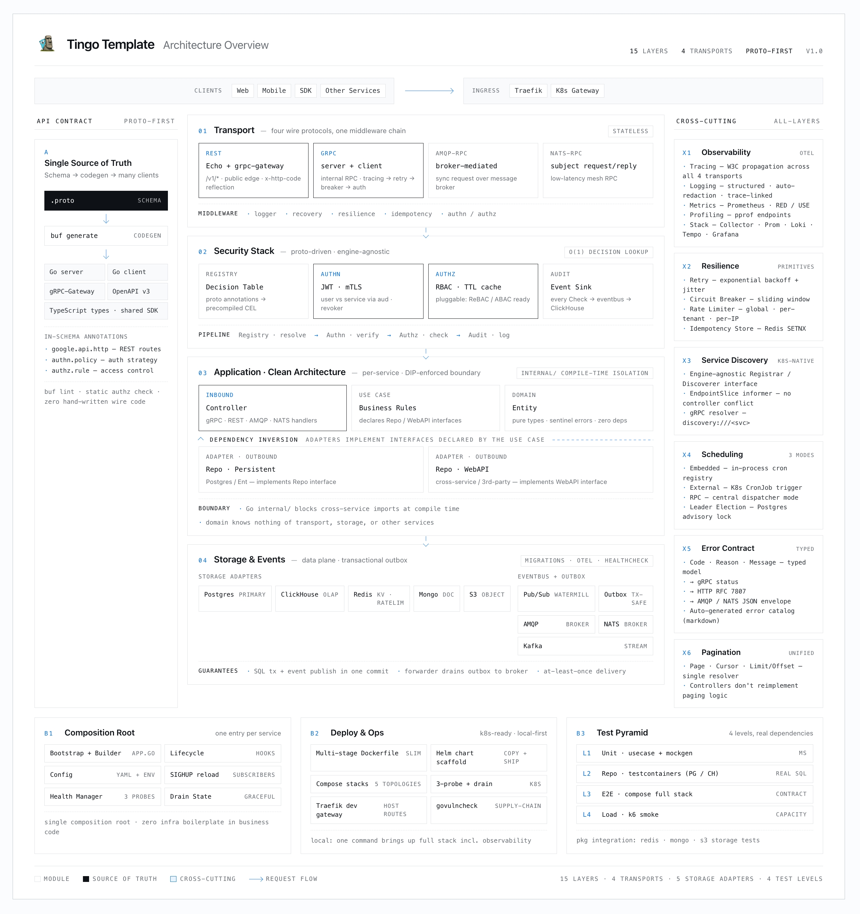

<p align="center">
  
</p>

<h1 align="center">Tingo</h1>

<p align="center"><em>Clean Architecture Go backend template — fork, edit, ship.</em></p>

<p align="center"><a href="README_CN.md">🇨🇳 中文</a></p>

<p align="center">
  <a href="LICENSE"></a>
  <a href="go.mod"></a>
  <a href="https://github.com/Go-Tingo/Tingo/stargazers"></a>
</p>

**A production-grade Go backend scaffold, out of the box.** Monolith or microservices on one architecture. Security, observability, resilience, testing, deployment — every production layer wired and ready.

Fork to own all of `pkg/`. Replaceable, extensible, and free of upstream lock-in.

Batteries included:

- **Four transports** — REST (Echo + grpc-gateway) + gRPC + AMQP-RPC + NATS-RPC, all driven from the same `.proto`.
- **Proto-driven access control** — `(tingo.authn.v1.policy)` + `(tingo.authz.v1.rule)` annotations on each RPC compile into a unified interceptor stack; no per-service auth middleware.
- **Eventbus** — watermill on AMQP / NATS / Kafka, plus a transactional outbox that commits business events atomically with the SQL tx.
- **Resilience** — retry, circuit breaker, rate-limit, idempotency primitives + per-transport adapters.
- **Storage bootstraps** — Postgres (Ent + pgx), Redis, ClickHouse, MongoDB, S3 — each with OTel, healthcheck, and a sensible default config.
- **Observability** — OTel SDK (W3C trace context across all four transports) + Prometheus + Loki + Tempo + Grafana, all wired in `make compose.up.all.obs`.
- **Test pyramid** — L1 unit (mocks) → L2 repo (testcontainers) → L3 e2e (compose) → L4 k6 load, each with its own Make target.
- **Scheduler** — cron jobs with three trigger modes (embedded loop / external tick / RPC-per-job) and Postgres-advisory-lock leader election.
- **Deploy** — multi-stage Dockerfile per service, `deployments/charts/tingo-template` Helm scaffold, K8s 3-probe split (`live`/`ready`/`startup`) with graceful drain.

## How to use it: clone & edit

Tingo is not consumed via `go get`. Fork the repo, rewrite the module path, and the code is yours.

```sh
git clone https://github.com/Go-Tingo/Tingo my-project
cd my-project && rm -rf .git && git init

# Rewrite the module path (covers .go imports + .proto go_package + buf refs)
OLD=github.com/Go-Tingo/Tingo
NEW=github.com/me/my-project
go mod edit -module $NEW
find . -type f \( -name '*.go' -o -name '*.proto' \) -exec sed -i '' "s|$OLD|$NEW|g" {} +
make proto.v1 && make ent && make mock

# Pick the closest archetype as your starting point and rename it
cp -r services/account services/my-svc      # public REST + JWT issuer
# or services/order        — internal gRPC + JWT verifier
# or services/notifier     — async event consumer
find services/my-svc -type f -exec sed -i '' 's|account|my-svc|g' {} +
```

That's the whole onboarding. Edit `services/my-svc/`, add a block in `deployments/compose/docker-compose.yml`, ship.

## Tingo Arch

<p align="center">
  
</p>
